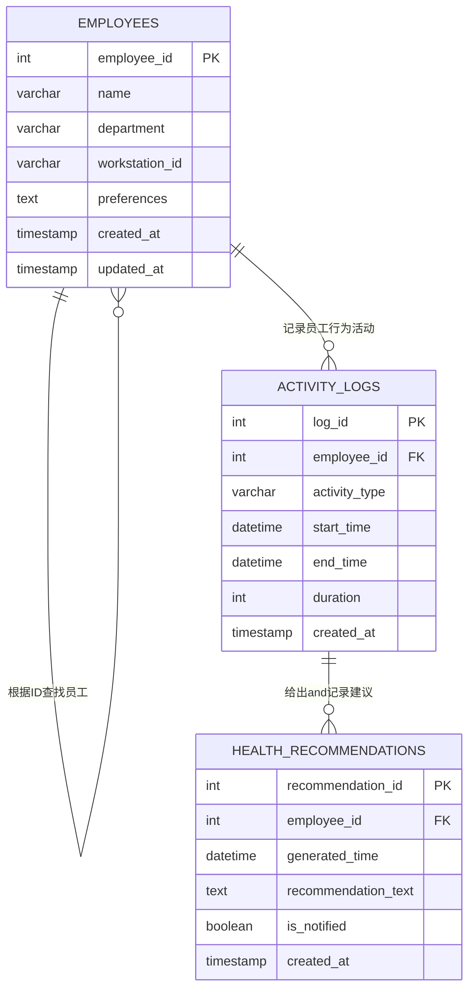

# 员工健康小助手系统 - 数据库设计文档

## pre & qus:

#### 表设计：

​	

   1.员工表 (`employees`)记录员工基本信息

​	`preferences` 喜好字段 

​			**比如设置期望运动时间 设置喝水水量这样？**

​			也可设置健康状态 更方便ai给出建议？（AI我不懂）

​			格式做个Json？比如这样 : 

​					{"reminder_interval": 60, "goal_daily_steps": 8000, "water_reminder": true}

​	创建时间和更新时间字段也可不使用 or 冗余

2. 活动记录表 (`activity_logs`)记录员工活动	

   **数据/分钟模拟进行插入**

   `activity_type` 活动类型字段

   ​		可以直接存字符串（sit/stand/walk/meeting) 

   ​		或者用数字代表特定类型 （1-sit , 2- stand,.........）

   

3. 健康建议记录表 (`health_recommendations`)

   **记录AI返回的建议数据**

   **返回建议 and 也可用于生成健康报告**

   返回给员工的数据

   

## 📊 数据关系图

**格式：数据类型 字段名 [约束]** 

## 📋 表结构详情

### 1. 员工表 (`employees`)

**描述**: 存储员工的基本信息和个人健康偏好设置

| 字段名           | 数据类型    | 约束                        | 默认值                      | 描述                   |
| ---------------- | ----------- | --------------------------- | --------------------------- | ---------------------- |
| `employee_id`    | INT         | PRIMARY KEY, AUTO_INCREMENT | -                           | 员工ID，主键           |
| `name`           | VARCHAR(50) | NOT NULL                    | -                           | 员工姓名               |
| `department`     | VARCHAR(50) | NOT NULL                    | -                           | 所在部门               |
| `workstation_id` | VARCHAR(20) | -                           | NULL                        | 工位编号               |
| `preferences`    | TEXT        | -                           | NULL                        | 健康偏好设置(JSON格式) |
| `created_at`     | TIMESTAMP   | -                           | CURRENT_TIMESTAMP           | 创建时间               |
| `updated_at`     | TIMESTAMP   | -                           | CURRENT_TIMESTAMP ON UPDATE | 更新时间               |

**索引**:
- 主键: `employee_id`

---

### 2. 活动记录表 (`activity_logs`)

**描述**: 记录员工的详细活动数据，是生成健康建议的核心依据

| 字段名          | 数据类型    | 约束                        | 默认值            | 描述                             |
| --------------- | ----------- | --------------------------- | ----------------- | -------------------------------- |
| `log_id`        | INT         | PRIMARY KEY, AUTO_INCREMENT | -                 | 记录ID，主键                     |
| `employee_id`   | INT         | FOREIGN KEY                 | -                 | 员工ID，外键关联employees表      |
| `activity_type` | VARCHAR(20) | NOT NULL                    | -                 | 活动类型(sit/stand/walk/meeting) |
| `start_time`    | DATETIME    | NOT NULL                    | -                 | 活动开始时间                     |
| `end_time`      | DATETIME    | NOT NULL                    | -                 | 活动结束时间                     |
| `duration`      | INT         | NOT NULL                    | -                 | 活动持续时间(秒)                 |
| `created_at`    | TIMESTAMP   | -                           | CURRENT_TIMESTAMP | 创建时间                         |

**索引**:
- 主键: `log_id`
- 外键: `employee_id` REFERENCES `employees(employee_id)`
- 普通索引: `idx_employee_id` (`employee_id`)
- 普通索引: `idx_activity_time` (`start_time`, `end_time`)

---

### 3. 健康建议记录表 (`health_recommendations`)

**描述**: 存储系统生成的健康建议记录

| 字段名                | 数据类型  | 约束                        | 默认值            | 描述                        |
| --------------------- | --------- | --------------------------- | ----------------- | --------------------------- |
| `recommendation_id`   | INT       | PRIMARY KEY, AUTO_INCREMENT | -                 | 建议ID，主键                |
| `employee_id`         | INT       | FOREIGN KEY                 | -                 | 员工ID，外键关联employees表 |
| `generated_time`      | DATETIME  | NOT NULL                    | -                 | 建议生成时间                |
| `recommendation_text` | TEXT      | NOT NULL                    | -                 | 建议内容                    |
| `is_notified`         | BOOLEAN   | -                           | FALSE             | 是否已通知员工              |
| `created_at`          | TIMESTAMP | -                           | CURRENT_TIMESTAMP | 创建时间                    |

**索引**:
- 主键: `recommendation_id`
- 外键: `employee_id` REFERENCES `employees(employee_id)`
- 普通索引: `idx_employee_generated` (`employee_id`, `generated_time`)
- 普通索引: `idx_notification_status` (`is_notified`)

---

## 🔗 表关系说明

- **一对多关系**: 
  - 一个员工 (`employees`) 可以有多条活动记录 (`activity_logs`)
  - 一个员工 (`employees`) 可以收到多条健康建议 (`health_recommendations`)

- **外键约束**:
  - `activity_logs.employee_id` → `employees.employee_id`
  - `health_recommendations.employee_id` → `employees.employee_id`
  - 使用 `ON DELETE CASCADE`，当员工被删除时，相关的活动记录和建议也会被自动删除

---

